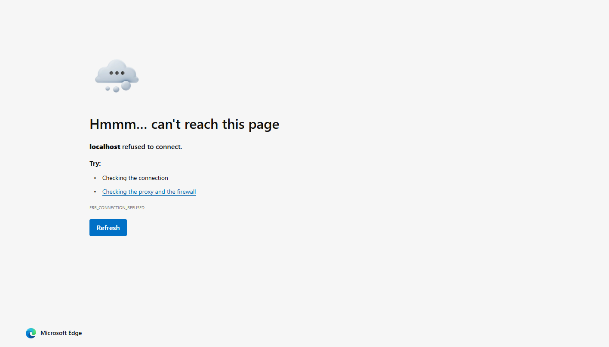

# Sentinel

Cyber defense operations dashboard with real-time network telemetry, 3D WebGL edge mapping, and host containment workflows.



## Features

- **Live Gateway Telemetry**: Dual-stream ingress/egress curves with interactive hover scrubbing, multi-window time series (1h, 6h, 24h, 7d), and traffic surge simulation.
- **3D Edge Mesh**: Interactive 60 FPS WebGL globe powered by [Cobe](https://github.com/shuding/cobe), tracking live request rates across 8 edge PoPs.
- **Host Containment**: Interactive network topology graph with one-click route isolation for compromised endpoints.
- **Malware Sandbox**: Client-side heuristic file inspection using Shannon entropy calculation and SHA-256 fingerprinting.
- **Incident Response**: Kanban triage board and global command palette (`⌘K` / `Ctrl+K`).
- **VisionOS Glass UI**: Low-fatigue dark interface using Outfit and Plus Jakarta Sans typography.

## Tech Stack

- React 18
- Tailwind CSS
- Cobe (WebGL Globe)
- Lucide Icons

## Getting Started

```bash
# Install dependencies
npm install

# Start development server
npm start

# Build for production
npm run build
```

## License

MIT
